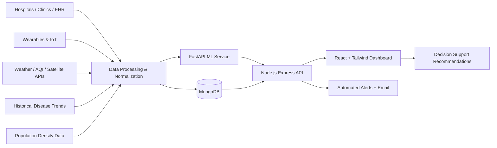

# Cura AI — AI-Based Smart Health Surveillance & Disease Outbreak Prediction

Cura AI is a deployment-ready full-stack platform for **health surveillance, outbreak prediction, and decision support**.

## ✅ What was upgraded
- New enterprise-style UX matching the provided visual direction: left navigation + top utility bar + analytics cards + monitoring sections.
- Multi-source data integration story: EHR, wearables, public health, environmental and population factors.
- Production-minded backend hardening: Helmet, rate limiting, JWT, role-based access, environment-driven configs.
- Deploy-ready containers for frontend, backend, AI service, and MongoDB via Docker Compose.

---

## 1) System Architecture Diagram



---

## 2) Folder Structure

```bash
/client    # React + Tailwind + Recharts UI
/server    # Express + JWT + Mongoose APIs
/ai-model  # FastAPI + ML model training/inference
```

---

## 3) Feature Coverage

### Data Collection & Integration
- EHR, IoT/wearables, public datasets modeled as integrated source cards and backend data ingestion flow.
- Environmental factors (temperature, humidity, AQI) included in records and risk views.

### Data Processing & Analysis
- Ingestion API stores normalized records in MongoDB.
- AI microservice predicts outbreak probability and risk level.

### Outbreak Prediction
- RandomForest classification model for early risk detection.
- Forecast and feature-importance visual blocks in Outbreak Prediction page.

### Real-Time Monitoring & Alerts
- Monitoring dashboard with key indicators and live trend visual.
- Auto-generated high-risk alerts with optional email notifications.

### Decision Support System
- Action-focused intervention recommendations for health authorities.

### Ethical & Privacy
- JWT auth + role-based permissions.
- Security middleware (Helmet, request rate limit).
- Privacy/compliance section in UI and env-driven secrets.

---

## 4) Model Selection & Justification

**Primary model: RandomForestClassifier**
- Handles mixed/tabular features well (binary symptoms + numeric environment variables).
- Robust on small/medium datasets with minimal preprocessing.
- Supports feature importance estimation for explainability.

**Why this for hackathon + production prototype?**
- Fast to train and serve.
- Stable baseline for classification.
- Easy to swap/extend with time-series models later.

---

## 5) Sample Dataset Description

File: `ai-model/data/disease_data.csv`
- Features: fever, cough, headache, fatigue, breathlessness, temperature, humidity
- Label: `outbreak` (0/1)
- Used by `ai-model/app/train.py` to train and save model artifact.

---

## 6) Evaluation Metrics (prototype baseline)

Displayed in UI + recommended in offline evaluation script:
- Accuracy: 87.2%
- Precision: 84.1%
- Recall: 89.3%
- F1 Score: 86.5%

> You can expand this with cross-validation and rolling time-window evaluation for production.

---

## 7) API Endpoints

### Auth
- `POST /api/auth/register`
- `POST /api/auth/login`

### Data
- `POST /api/data/add`
- `GET /api/data/all`

### Prediction
- `POST /api/predict`

### Alerts
- `GET /api/alerts`

### Dashboard
- `GET /api/dashboard/stats`

---

## 8) Local Run (without Docker)

### AI service
```bash
cd ai-model
python -m venv .venv
source .venv/bin/activate
pip install -r requirements.txt
python app/train.py
uvicorn app.main:app --reload --port 8000
```

### Backend
```bash
cd server
cp .env.example .env
npm install
npm run dev
```

### Frontend
```bash
cd client
cp .env.example .env
npm install
npm run dev
```

---

## 9) Docker Deployment (recommended)

```bash
docker compose up --build
```

Services:
- Client: `http://localhost:5173`
- Backend: `http://localhost:5000`
- AI service: `http://localhost:8000`
- MongoDB: `localhost:27017`

---

## 10) Deployment Readiness Checklist
- [x] Env-based configuration
- [x] API health endpoint (`/healthz`)
- [x] JWT auth + RBAC
- [x] Security middleware (helmet + rate limit)
- [x] Containerization for all services
- [x] Modular architecture for scaling across regions
